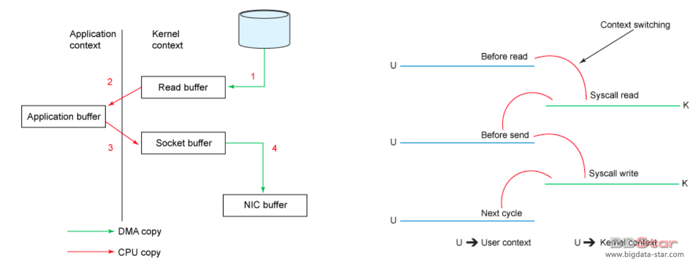

# Kafka高性能原理

Kafka如何保证高性能呢？主要是通过如下几个方面：
* 高效使用磁盘
* 零拷贝
* 批处理
* 压缩
* Partition
* ISR

## 高效使用磁盘
### 顺序写磁盘
Kafka使用了基于日志结构(log-structured)的数据格式，即每个分区日志只能在尾部追加写入(append)，而不允许随机“跳到”某个位置开始写入，故此实现了顺序写入。
经过多方论证，顺序写磁盘性能与随机写内存持平或者高于随机写内存。

### Append Only
因为kafka是对日志文件进行append操作,因此磁盘检索的开支是较小的;同时为了减少磁盘写入的次数,broker会将消息暂时buffer起来,当消息的个数(或尺寸)达到一定阀值时,再flush到磁盘,这样减少了磁盘IO调用的次数.对于kafka而言,较高性能的磁盘,将会带来更加直接的性能提升.

### Page Cache
page cache，又称pcache，其中文名称为页高速缓冲存储器，简称页高缓。page cache的大小为一页，通常为4K。在linux**读写文件时，它用于缓存文件的逻辑内容**，从而加快对磁盘上映像和数据的访问。
Kafka中读写message有如下特点:
* 写message：消息**从java heap转入page cache**（这样就减少了GC的负担）。由异步线程刷盘,消息从page cache刷入磁盘。
* 读message：消息**直接从page cache**转入socket发送出去。当从page cache没有找到相应数据时，此时会产生磁盘IO,从磁盘Load消息到page cache,然后直接从socket发出去。

## 零拷贝
传统模式下数据从文件传输到网络需要4次拷贝：
```java
File.read(desc,buf,len)
Socket.send(socket,buf,len)
```


1. 从文件拷贝到Read Buffer；
2. 拷贝到Application Buffer（即我们在File.read中定义的那个buf中 )；
3. Application Buffer中的数据拷贝到Socket Buffer缓冲区；
4. 最后拷贝到网络接口卡的Buffer中去；

我们可以看到，有两次CPU拷贝，两次DMA(直接内存存取)拷贝。
KAFKA中实现零拷贝指的是没有CPU拷贝。通过NIO的transferTo/transferFrom调用操作系统的sendfile实现零拷贝。总共发生2次内核数据拷贝。

## 批处理
回顾上节调优课程中，我们对以下几个参数有过讲解：
batch.size: 批处理大小(字节为单位)。发送消息并不是说来一条我就发一条，会一个批次一个批次的发，这有助于提高客户机和服务器的性能。
max.partition.fetch.bytes ：每次从单个分区中拉取的消息最大数量(单位byte)。
Producer和Consumer均支持批量处理数据，从而减少了网络传输的开销。

## 压缩
Producer可将数据压缩后发送给broker，从而减少网络传输代价。目前支持Snappy, Gzip和LZ4压缩。比如上节课程我们设置了compression.type为snappy。

## Partition
* KAFKA通过Partition实现了**并行处理和水平扩展**。
* Partition是Kafka（包括Kafka Stream）并行处理的最小单位
* 不同Partition可处于**不同的Broker（节点），充分利用多机资源**。同一Broker（节点）上的不同Partition可置于不同的Directory，如果节点上有多个Disk Drive，可将不同的Drive对应不同的Directory，从而使Kafka充分利用多Disk Drive的磁盘优势

## ISR
**可用性与一致性动态平衡**
* 当ACK=all时，只有ISR列表中所有节点都确认接收了，消息才会被Commit。
* 可以动态的把一些节点从ISR中移除，比如某个节点落后leader太多，就把它移除，判断依据是replica.lag.time.max.ms。
**ISR可容忍更多的节点失败**
* Majority Quorum如果要容忍f个节点失败，则至少需要2f+1个节点
* ISR如果要容忍f个节点失败，至少需要f+1个节点
**如何处理Replica Crash**
* Leader crash后，ISR中的任何replica皆可竞选成为Leader
* 如果所有replica都crash，可选择让第一个recover的replica或者第一个在ISR中的replica成为leader

